# Vectors and the Geometry of Space

## Three-Dimensional Coordinate Systems

### 3D Space

In order to represent points in space, we first choose a fixed point $O$ (the origin) and three directed lines through $O$ that are perpendicular to each other, called the **coordinate aces** and labeled the $x$-axis, $y$-axis, and $z$-axis.

The direction of the $z$-axis is determined by the **right-hand rule** as illustrated in the figure:

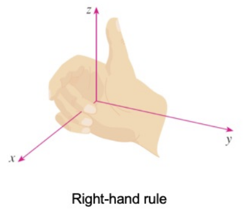

If you curl the fingers of your right hand around the $z$-axis in the direction of a $90\degree$ counterclockwise rotation from the positive $x$-axis to the positive $y$-axis, then your thumb points in the positive direction of the $z$-axis.

The three coordinate axes determined the three coordinate planes illustrated in the figure.

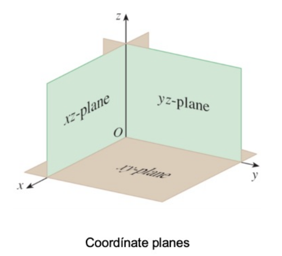

These three coordinate planes divide space into 8 parts, called **octants**(卦限八分区). The **first octant**, in the foreground, is determined by the positive axes.

Thus, to locate the point $(a,b,c)$, we can start at the origin $O$ and move $a$ units along the $x$-axis, then $b$ units parallel to the $y$-axis, and then $c$ units parallel to the $z$-axis. The point $P(a,b,c)$ determins a rectangular box. If we drop a perpendicular from $P$ to the $xy$-plane, we get a point $Q$ with coordinates $(a,b,0)$ called the **projection** of $P$ onto the $xy$-plane. Similarly, $R(0,b,c)$ and $S(a,0,c)$ are the projections of $P$ onto the $yz$-plane and $xz$-plane, respectively.

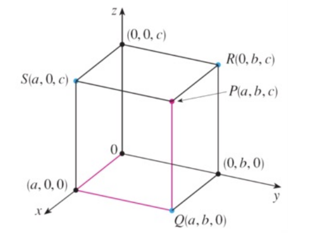

The Cartesian product $\R\times\R\times\R = \{(x,y,z)|x,y,z\in\R\}$ is the set of all ordered triples of real numbers and is denoted by $\R^3$.

We have given a one-to-one correspondence between points $P$ in space and an ordered triples $(a,b,c)$ in $\R^3$. It is called a **three-dimensional rectangular coordinate system**. Notice that, in terms of coordinates, the first octant can be described as the set of points whose coordinates are all positive.

### Surfaces and Solids

In two-dimensional analytic geometry, the graph of an equation involving $x$ and $y$ is a curve in $\R^2$. In three-dimensional analytic geometry, an equation in $x,y,z$ represents a surface in $\R^3$

In general, if $k$ is a constant, then $x=k$ represents a plane parallel to the $yz$-plane, $y=k$ is a plane parallel to the $xz$-plane, and $z=k$ is a plane parallel tothe $xy$-plane.

### Distance and Spheres

**Distance Formula in Three Dimensions**: The distance $|P_1P_2|$ between the points $P_1(x_1,y_1,z_1)$ and $P_2(x_2,y_2,z_2)$ is 
$$
\begin{aligned}
|P_1P_2| &= \sqrt{ (x_2-x_1)^2+(y_2-y_1)^2+(z_2-z_1)^2 }
\\[10pt]
&= \sqrt{(P_1-P_2)^T(P_1-P_2)}
\end{aligned}
$$
**Equation of a Sphere**: An equation of a sphere with center $C(h,k,l)$ and radius $r$ is 
$$
(x-h)^2+(y-k)^2+(z-l)^2 = r^2
$$
In particular, if the center is the origin $O$, then an equation of the sphere is 
$$
x^2+y^2+z^2=r^2
$$

## Vectors

The term **vector** is used in mathematics to indicate a quantity that has both magnitude and direction.

### Geometric Description of Vectors

A vector is often represented by an arrow or a directed line segment. The length of the arrow represents the magnitude of the vector and the arrow points in the direction of the vector. We denote a vector by printing a letter in boldface $\boldsymbol{v}$ or by putting an arrow above the letter $\vec{v}$.

For instance, suppose a particle moves along a line segment from point $A$ to point $B$. The corresponding **displace ment vector $\boldsymbol{v}$** has **initial point** $A$ and **terminal point** $B$ and we indicate this by writing $\boldsymbol{v}=\vec{AB}$

We say that $\boldsymbol{u}$ and $\boldsymbol{v}$ are **equivalent** (or **equal**) and we write $\boldsymbol{u}=\boldsymbol{v}$

The **zero vector**, denote by $\boldsymbol{0}$, has length 0. It is the only vector with no specific direction.

**Definition of Vector Addition**: If $\boldsymbol{u}$ and $\boldsymbol{v}$ are vectors positioned so the initial point of $\boldsymbol{v}$ is at the terminal point of $\boldsymbol{u}$, then the **sum** $\boldsymbol{u}+\boldsymbol{v}$ is the vector from the initial point of $\boldsymbol{u}$ to the bermiinal point of $\boldsymbol{v}$.

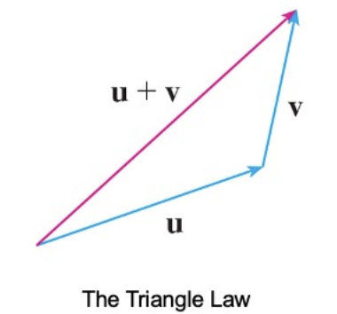

**Parallelogram Law**: If we place $\boldsymbol{u}$ and $\boldsymbol{v}$ so they start at the same point, then $\boldsymbol{u}+\boldsymbol{v}$ lies along the diagonal of the parallelogram with $\boldsymbol{u}$ and $\boldsymbol{v}$ as sides.

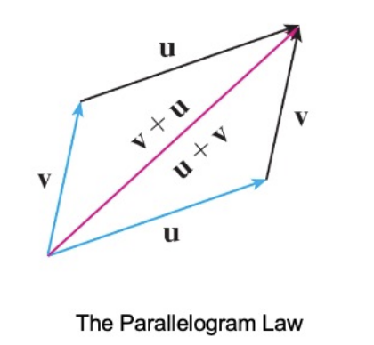

**Definition of Scalar Multiplication**: If $c$ is a scalar and $\boldsymbol{v}$ is a vector, then the **scalar multiple** $c\boldsymbol{v}$ is the vector whose length is $|c|$ times the length of $\boldsymbol{v}$ and whose direction is the same as $\boldsymbol{v}$ if $c>0$ and is opposite to $\boldsymbol{v}$ if $c<0$. If $c=0$ or $\boldsymbol{v}=\boldsymbol{0}$, then $c\boldsymbol{v}=\boldsymbol{0}$.

### Components of a Vector

For some purposes it's best to introduce a coordinate system and treat vectors algebraically.

If we place the initial point of a vector $\boldsymbol{a}$ at the origin of a rectangular coordinate system, then the terminal point of a has coordinates of the form $(a_1,a_2)$ or $(a_1,a_2,a_3)$, depending on whether coordinate system is 2 or 3 dimensional.

These coordinates are called the **components** of $\boldsymbol{a}$ and we write
$$
\boldsymbol{a}=\langle a_1,a_2 \rangle \quad\text{or}\quad\boldsymbol{a}=\langle a_1,a_2,a_3\rangle
$$
We use the notation $\langle a_1,a_2\rangle$ for the ordered pair that refers to a vector so as not to confuse it with the ordered pair $(a_1,a_2)$ that refers to a point in the plane.

In three dimensions, the vector $\boldsymbol{a}=\vec{OP}=\langle a_1,a_2,a_3 \rangle$ is the **position vector** of the point $P(a_1,a_2,a_3)$.

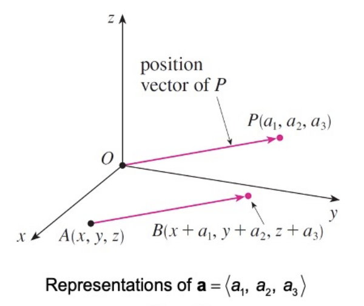

Given the points $A(x_1,y_1,z_1)$ and $B(x_2,y_2,z_2)$, the vector $\boldsymbol{a}$ with representation $\vec{AB}$ is
$$
\boldsymbol{a} = \langle x_2-x_1,y_2-y_1,z_2-z_1 \rangle
$$
The **magnitude** or **length** of the vector $\boldsymbol{v}$ is the length of any of itsrepresentations and is denoted by the symbol $|\boldsymbol{v}|$ or $\|\boldsymbol{v}\|$. By using the distance formula to compute the length of a segment $OP$, we obtain the following formulas.

The length of the $n$-dimensional vector $\boldsymbol{a}=\langle a_1,\dots,a_n \rangle$ is
$$
|\boldsymbol{a}| = \sqrt{\sum_{i=1}^na_{i}^2}
$$
We denote by $V_2$, the set of all two-dimensional vectors and by $V_3$, the set of allthree-dimensiona  vectors. More generally, we will consider the set $V_n$, of all $n$-dimensional vectors.

Three vectors in $V_3$ play a special role. Let
$$
\boldsymbol{i} = \langle1,0,0\rangle\quad\boldsymbol{j} = \langle0,1,0\rangle\quad \boldsymbol{k} = \langle0,0,1\rangle
$$
These vectors $\boldsymbol{i,j,k}$ are called the standard basis vectors. They have length 1 and point in the directions of the positive $x,y,z$-axes.

A **unit vector** is a vector whose length is 1. For instance, $\boldsymbol{i,j,k}$ are all unit vectors. In general, if $\boldsymbol{a}\ne0$, then the unit vector that has the same direction as $\boldsymbol{a}$ is
$$
\boldsymbol{u}=\frac{\boldsymbol{a}}{|\boldsymbol{a}|}
$$
In order to verify this, we let $c=\frac{1}{|\boldsymbol{a}|}$. Then $\boldsymbol{u}=c\boldsymbol{a}$ and $c$ is a positive scalar, so $\boldsymbol{u}$ has the same direction as $\boldsymbol{a}$.

## The Dot Product

### Dot Product of Two Vectors

To find the dot product of vectors $\boldsymbol{a}$ and $\boldsymbol{b}$ we multiply correspondingcomponents and add.

#### Definition

If $\boldsymbol{a}=\langle a_1,a_2,a_3 \rangle$ and $\boldsymbol{b}=\langle b_1,b_2,b_3 \rangle$, then the **dot product** of $\boldsymbol{a}$ and $\boldsymbol{b}$ is the number $\boldsymbol{a}\cdot\boldsymbol{b}$ given by
$$
\boldsymbol{a}\cdot\boldsymbol{b}=a_1b_1+a_2b_2+a_3b_3
$$

#### Properties

If $\boldsymbol{a}$, $\boldsymbol{b}$ and $\boldsymbol{c}$ are vectors in $V_3$ and $c$ is a scalar, then
$$
\begin{aligned}
\boldsymbol{a}\cdot\boldsymbol{a}&=|a|^2
\\
\boldsymbol{a}\cdot\boldsymbol{b} &= \boldsymbol{b}\cdot\boldsymbol{a}
\\
\boldsymbol{a}\cdot(\boldsymbol{b}+\boldsymbol{c}) &= \boldsymbol{a}\cdot\boldsymbol{b}+\boldsymbol{a}\cdot\boldsymbol{c}
\\
(c\boldsymbol{a})\cdot(\boldsymbol{b})&=c(\boldsymbol{a}\cdot\boldsymbol{b})=\boldsymbol{a}\cdot(c\boldsymbol{b})
\\
\boldsymbol{0}\cdot\boldsymbol{a}&=0
\end{aligned}
$$

#### Theorem

If $\theta$ is the angle between the vectors $\boldsymbol{a}$ and $\boldsymbol{b}$, then 
$$
\begin{aligned}
\boldsymbol{a}\cdot\boldsymbol{b}&=|\boldsymbol{a}||\boldsymbol{b}|\cos\theta
\\
\cos\theta&=\frac{\boldsymbol{a}\cdot\boldsymbol{b}}{|\boldsymbol{a}||\boldsymbol{b}|}
\end{aligned}
$$

#### Perpendicular or Orthogonal

Two nonzero vectors $\boldsymbol{a}$ and $\boldsymbol{b}$ are called **perpendicular** or **orthogonal** if the angle between them is $\theta=\frac{\pi}{2}$. Then the theorem gives
$$
\boldsymbol{a}\cdot\boldsymbol{b}=|\boldsymbol{a}||\boldsymbol{b}|\cos\left( \frac{\pi}{2} \right)=0
$$
and conversely if $\boldsymbol{a}\cdot\boldsymbol{b}=0$, then $\cos\theta=0$, so $\theta=\frac{\pi}{2}$. The zero vector $\boldsymbol{0}$ is considered to be perpendicular to all vectors. Therefore we have the following method for determining whether two vectors are orthogonal:
$$
\boldsymbol{a}\perp\boldsymbol{b} \equiv \boldsymbol{a}\cdot\boldsymbol{b}=0
$$

### Direction Angles and Direction Cosines

The **direction angles** of a nonzero vector $\boldsymbol{a}$ are the angles $\alpha,\beta,\gamma$ (in the interval $[0,\pi]$) that $\boldsymbol{a}$ makes with the positive $x,y,z$-axes, respectively.

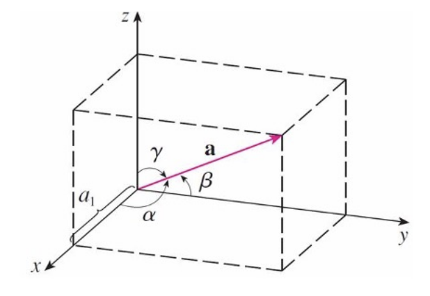

The cosines of these direction angles, $\cos\alpha,\cos\beta,\cos\gamma$ are called the **direction cosines** of the vector $\boldsymbol{a}$.
$$
\begin{aligned}
&\cos\alpha=\frac{\boldsymbol{a}\cdot\boldsymbol{i}}{|\boldsymbol{a}||\boldsymbol{i}|}=\frac{\boldsymbol{a}_1}{|\boldsymbol{a}|}
\\[10pt]
&\cos\beta=\frac{\boldsymbol{a}\cdot\boldsymbol{j}}{|\boldsymbol{a}||\boldsymbol{j}|}=\frac{\boldsymbol{a}_2}{|\boldsymbol{a}|}
\\[10pt]
&\cos\gamma=\frac{\boldsymbol{a}\cdot\boldsymbol{z}}{|\boldsymbol{a}||\boldsymbol{z}|}=\frac{\boldsymbol{a}_3}{|\boldsymbol{a}|}
\\[10pt]
&\cos^2\alpha+\cos^2\beta+\cos^2\gamma=1
\end{aligned}
$$

### Projections

If $S$ is the foot of the perpendicular from $R$ to the line containing $\vec{PQ}$, then the vector with representation $\vec{PS}$ is called the **vector projection** of $\boldsymbol{b}$ onto $\boldsymbol{a}$ and is denoted by $\text{proj}_{\boldsymbol{a}}\boldsymbol{b}$

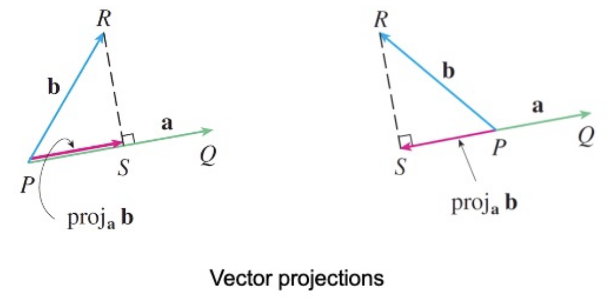

The **scalar projection** of $\boldsymbol{b}$ onto $\boldsymbol{a}$ (also called the **component of $\boldsymbol{b}$ along $\boldsymbol{a}$**) is defined to be the signed magnitude of the vector projection, which is the number $|\boldsymbol{b}|\cos{\theta}$, where $\theta$ is the angle between $\boldsymbol{a}$ and $\boldsymbol{b}$. This is denoted by $\text{comp}_{\boldsymbol{a}}\boldsymbol{b}$. Observe that it's negative if $\frac{\pi}{2}\lt\theta\le\pi$. 

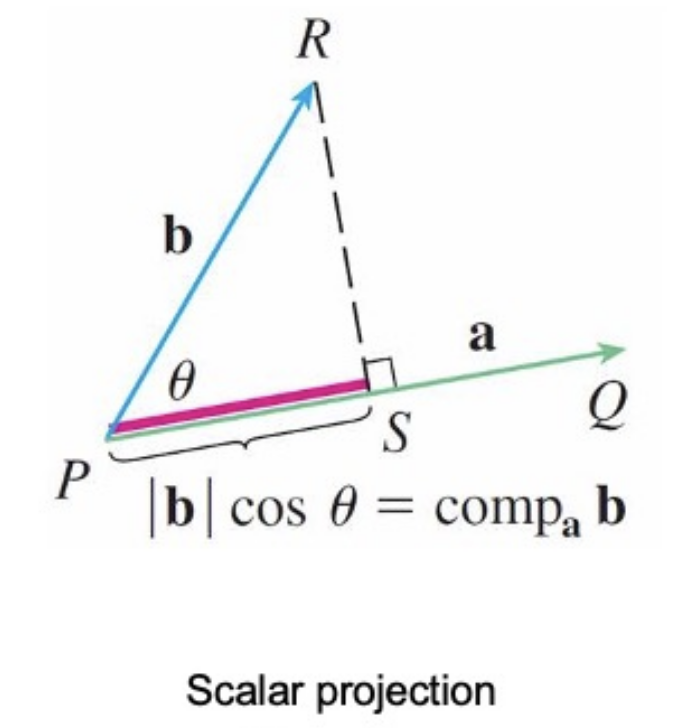

The equation
$$
\boldsymbol{a}\cdot\boldsymbol{b}=|\boldsymbol{a}||\boldsymbol{b}|\cos\theta=|\boldsymbol{a}|(|\boldsymbol{b}|\cos\theta)
$$
Shows that the dot product of $\boldsymbol{a}$ and $\boldsymbol{b}$ can be interpreted as the length of $\boldsymbol{a}$ times the scalar projection of $\boldsymbol{b}$ onto $\boldsymbol{a}$. Since
$$
|\boldsymbol{b}|\cos\theta=\frac{\boldsymbol{a}\cdot\boldsymbol{b}}{|\boldsymbol{a}|}=\frac{\boldsymbol{a}}{|\boldsymbol{a}|}\cdot\boldsymbol{b}
$$
the component of $\boldsymbol{b}$ along $\boldsymbol{a}$ can be computed by taking the dot product of $\boldsymbol{b}$ with the unit vector in the direction of $\boldsymbol{a}$

We summarize these ideas as follows:

- Scalar projection of $\boldsymbol{b}$ onto $\boldsymbol{a}$: $\text{comp}_{\boldsymbol{a}}\boldsymbol{b}=\frac{\boldsymbol{a}\cdot\boldsymbol{b}}{|\boldsymbol{a}|}$

- Vector projection of $\boldsymbol{b}$ onto $\boldsymbol{a}$: $\text{proj}_{\boldsymbol{a}}\boldsymbol{b}=\left(\text{comp}_{\boldsymbol{a}}\boldsymbol{b} \right)\frac{\boldsymbol{a}}{|\boldsymbol{a}|}=\frac{\boldsymbol{a}\cdot\boldsymbol{b}}{|\boldsymbol{a}|^2}\boldsymbol{a}$

## Cross Product (Vector Product)

### Cross Product of 2 Vectors

**Definition of the Cross Product**: If $\boldsymbol{a}=\langle a_1,a_2,a_3 \rangle$ and $\boldsymbol{b}=\langle b_1,b_2,b_3 \rangle$, then the **cross product** of $\boldsymbol{a}$ and $\boldsymbol{b}$ is the vector
$$
\boldsymbol{a}\times\boldsymbol{b}=\langle a_2b_3-a_3b_2,a_3b_1-a_1b_3,a_1b_2-a_2b_1 \rangle
$$
Notice that the **cross product** $\boldsymbol{a}\times\boldsymbol{b}$ of two vectors $\boldsymbol{a}$ and $\boldsymbol{b}$ is the vector. For this reason it's also called the **vector product**.

A **determinant of order 3** can be defined in terms of second-order determinants
$$
\begin{vmatrix}
\boldsymbol{i}&\boldsymbol{j}&\boldsymbol{k}\\
a_1&a_2&a_3\\
b_1&b_2&b_3
\end{vmatrix}
=\begin{vmatrix}
a_2&a_3\\
b_2&b_3
\end{vmatrix}\boldsymbol{i}
-\begin{vmatrix}
a_1&a_3\\
b_1&b_3
\end{vmatrix}\boldsymbol{j}
+\begin{vmatrix}
a_2&a_3\\
b_12&b_3
\end{vmatrix}\boldsymbol{k}
$$
That is the cross product of two vectors $\boldsymbol{a}$ and $\boldsymbol{b}$

### Properties of the Cross Product

#### Orthogonality

The vector $\boldsymbol{a}\times\boldsymbol{b}$ is orthogonal to both $\boldsymbol{a}$ and $\boldsymbol{b}$. This can be easily proved by dot product.

If $\boldsymbol{a}$ and $\boldsymbol{b}$ are represented by directed line segments with the same initial point, then the cross product $\boldsymbol{a}\times\boldsymbol{b}$ points in a direction perpendicular to the plane through $\boldsymbol{a}$ and $\boldsymbol{b}$.

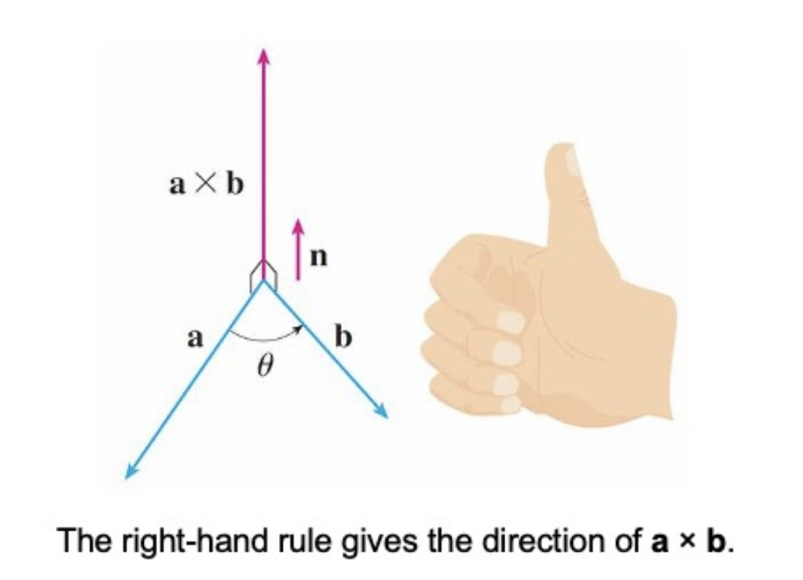

#### Magnitude

If $\theta$ is the angle between $\boldsymbol{a}$ and $\boldsymbol{b}$ (so $0\le\theta\le\pi$), then the length of the cross product $\boldsymbol{a}\times\boldsymbol{b}$ is given by
$$
|\boldsymbol{a}\times\boldsymbol{b}|=|\boldsymbol{a}||\boldsymbol{b}|\sin\theta
$$
This leads to a corollary: 2 nonzero vectors $\boldsymbol{a}$ and $\boldsymbol{b}$ are parallel if and only if
$$
\boldsymbol{a}\times\boldsymbol{b}=\boldsymbol{0}
$$
Since a vector is completely determined by its magnitude and direction, we can now say that for nonparallel vectors $\boldsymbol{a}$ and $\boldsymbol{b}$, $\boldsymbol{a}\times\boldsymbol{b}$ is the vector that is perpendicular to both $\boldsymbol{a}$ and $\boldsymbol{b}$, whose orientation is determined by the right-hand rule, and whose length is $|\boldsymbol{a}||\boldsymbol{b}|\sin\theta$.

#### Geometric Interpretation

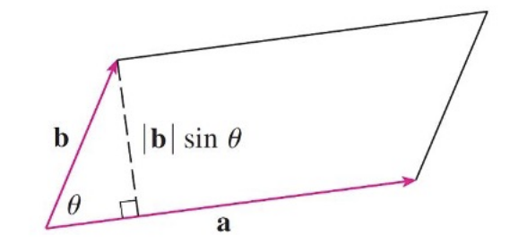

If $\boldsymbol{a}$ and $\boldsymbol{b}$ are represented by directed line segments with the same initial point, then they determined a parallelogram with base $|\boldsymbol{a}|$, altitude $|\boldsymbol{b}|\sin\theta$, and area
$$
A=|\boldsymbol{a}|(|\boldsymbol{b}|\sin\theta)=|\boldsymbol{a}\times\boldsymbol{b}|
$$
Thus we have the following way of interpreting the magnitude of a cross product. The length of the cross product $\boldsymbol{a}\times\boldsymbol{b}$ is equal to the area of the parallelogram determined by $\boldsymbol{a}$ and $\boldsymbol{b}$.

#### Others

If $\boldsymbol{a}$, $\boldsymbol{b}$ and $\boldsymbol{c}$ are vectors and $c$ is a scalar, then
$$
\begin{aligned}
\boldsymbol{a}\times\boldsymbol{b}&=-\boldsymbol{b}\times\boldsymbol{a}
\\[10pt]
(c\boldsymbol{a})\times\boldsymbol{b}&=c(\boldsymbol{a}\times\boldsymbol{b})=\boldsymbol{a}\times(c\boldsymbol{b})
\\[10pt]
\boldsymbol{a}\times(\boldsymbol{b}+\boldsymbol{c})&=\boldsymbol{a}\times\boldsymbol{b}+\boldsymbol{a}\times\boldsymbol{c}
\\[10pt]
(\boldsymbol{a}+\boldsymbol{b})\times\boldsymbol{c}&=\boldsymbol{a}\times\boldsymbol{c}+\boldsymbol{b}\times\boldsymbol{c}
\\[10pt]
\boldsymbol{a}\cdot(\boldsymbol{b}\times\boldsymbol{c})&=(\boldsymbol{a}\times\boldsymbol{b})\cdot\boldsymbol{c}
\\[10pt]
\boldsymbol{a}\times(\boldsymbol{b}\times\boldsymbol{c})&=(\boldsymbol{a}\cdot\boldsymbol{c})\boldsymbol{b}-(\boldsymbol{a}\cdot\boldsymbol{b})\boldsymbol{c}
\end{aligned}
$$

### Triple Products

The product $\boldsymbol{a}\cdot(\boldsymbol{b}\times\boldsymbol{c})$ is called the **scalar triple product** of the vectors $\boldsymbol{a}$, $\boldsymbol{b}$ and $\boldsymbol{c}$. We can write the scalar triple product as a determinant:
$$
\boldsymbol{a}\cdot(\boldsymbol{b}\times\boldsymbol{c})=
\begin{vmatrix}
a_1&a_2&a_3\\
b_1&b_2&b_3\\
c_1&c_2&c_3
\end{vmatrix}
$$
The geometric significance of the scalar triple product can be seen by considering the parallelpiped determined by the vectors $\boldsymbol{a}$, $\boldsymbol{b}$ and $\boldsymbol{c}$.

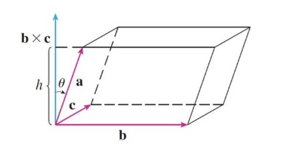

If $\theta$ is the angle between $\boldsymbol{a}$ and $\boldsymbol{b}\times\boldsymbol{c}$, then the height $h$ of the parallelepiped is $h=|\boldsymbol{a}||\cos\theta|$. Therefore, the volume of the parallelepiped is
$$
V=Ah=|\boldsymbol{b}\times\boldsymbol{c}||\boldsymbol{a}||\cos\theta|=|\boldsymbol{a}\cdot(\boldsymbol{b}\times\boldsymbol{c})|
$$
If the volume of the parallelepiped determined by $\boldsymbol{a}$, $\boldsymbol{b}$ and $\boldsymbol{c}$ is 0, then the vectors must lie in the same plane; that is, they are **coplanar**.

## Equations of Lines and Planes

### Lines

A line $L$ in three-dimensional space is determined when we know a point $P_0(x_0,y_0,z_0)$ on $L$ and the direction of $L$, which is conveniently described by a vector $\boldsymbol{v}$ parallel to the line. Let $P(x,y,z)$ be an arbitrary point on $L$ and let $\boldsymbol{r}_0$ and $\boldsymbol{r}$ be the position vectors of $P_0$ and $P$. If $\boldsymbol{a}$ is the vector with representation $\vec{P_0P}$, then the Triangle Law for vector addition gives $\boldsymbol{r}=\boldsymbol{r_0}+\boldsymbol{a}$. Since $\boldsymbol{a}$ and $\boldsymbol{v}$ are parallel vectors, there is a scalar $t$ such that $\boldsymbol{a}=t\boldsymbol{v}$. Thus
$$
\boldsymbol{r}=\boldsymbol{r}_0+t\boldsymbol{v}
$$
which is a **vector equation** of $L$. Each value of the **parameter** $t$ gives the position vector $\boldsymbol{r}$ of a point on $L$. In other words, as $t$ varies, the line is traced out by the tip of the vector $\boldsymbol{r}$.

Therefore we have the three scalar equations
$$
x=x_0+at\quad y=y_0+bt\quad z=z_0+ct
$$
These equations are called **parametric equations** of the line $L$ through the point $P_0(x_0,y_0,z_0)$ and parallel to the vector $\boldsymbol{v}=\langle a,b,c \rangle$. Each value of the parameter $t$ gives a point $(x,y,z)$ on $L$.

In general, if a vector $\boldsymbol{v}=\langle a,b,c \rangle$ is used to describe the direction of a line $L$, then the numbers $a,b,c$ are called **direction numbers** of $L$. 

If none of $a,b,c$ is 0, we can solve each of these equations for $t$:
$$
t=\frac{x-x_0}{a}=\frac{y-y_0}{b}=\frac{z-z_0}{c}
$$
These equations are called **symmetric equations** of $L$. 

If one of $a,b,c$ is 0, we can still eliminate $t$. For instance, if $a=0$, we could write the equation of $L$ as
$$
x=x_0,\quad \frac{y-y_0}{b}=\frac{z-z_0}{c}
$$
This means that $L$ lies in the vertical plane $x=x_0$.

### Planes

A plane in space is determined by a point $P_0(x_0,y_0,z_0)$ in the plane and a vector $\boldsymbol{n}$ that is orthogonal to the plane. This orthogonal vector $\boldsymbol{n}$ is called a **normal vector**. Let $P(x,y,z)$ be an arbitrary point in the plane, and let $\boldsymbol{r}_0$ and $\boldsymbol{r}$ be the position vectors of $P_0$ and $P$. Then the vector $\boldsymbol{r}-\boldsymbol{r}_0$ is represented by $\vec{P_0P}$. The normal vector $\boldsymbol{n}$ is orthogonal to every vector in the given plane. In particular, $\boldsymbol{n}$ is orthogonal to $\boldsymbol{r}-\boldsymbol{r}_0$ and so we have
$$
\boldsymbol{n}\cdot(\boldsymbol{r}-\boldsymbol{r}_0)=0
$$
which can be written as
$$
\boldsymbol{n}\cdot\boldsymbol{r}=\boldsymbol{n}\cdot\boldsymbol{r}_0
$$
This is called a **vector equation of the plane**.

To obtain a scalar for the plane, we write
$$
\boldsymbol{n}=\langle a,b,c \rangle,\quad\boldsymbol{r}=\langle x,y,z \rangle,\quad \boldsymbol{r}_0=\langle x_0,y_0,z_0 \rangle
$$
Then the vector equation becomes
$$
\langle a,b,c \rangle\cdot\langle x-x_0,y-y_0,z-z_0 \rangle=0
$$
A **scalar equation of the plane** through point $P_0(x_0,y_0,z_0)$ with normal vector $\boldsymbol{n}=\langle z,b,c \rangle$ is
$$
a(x-x_0)+b(y-y_0)+c(z-z_0)=0
$$
We can rewrite the equation of a plane as
$$
ax+by+cz+d=0
$$
where $d=-(ax_0+by_0+cz_0)$. This is called a **linear equation** in $x,y,z$. Conversely, it can bes hown that if $a,b,c$ are not all 0, then the linear equation represents a plane with normal vector $\langle a,b,c \rangle$. 

Two planes are **parallel** if their normal vectors are parallel. If two planes are not parallel, then they intersect in a straight line and the angle between the two planes is defined as the acute angle between their normal vectors.

### Distances

Find a formula for the distance $D$ from a point $P_1(x_1,y_1,z_1)$ to the plane $ax+by+cz+d=0$. Let $P_0(x_0,y_0,z_0)$ be any point in the given plane and let $\boldsymbol{b}$ be the vector corresponding to $\vec{P_0P_1}$. Then
$$
\boldsymbol{b}=\langle x_1-x_0,y_1-y_0,z_1-z_0 \rangle
$$
The distance $D$ from $P_1$ to the plane is equal to the absolute value of the scalar projection of $\boldsymbol{b}$ onto the normal vector $\boldsymbol{n}=\langle a,b,c \rangle$. Thus
$$
\begin{aligned}
D&=|\text{comp}_{\boldsymbol{n}}\boldsymbol{b}|=\frac{\boldsymbol{n}\cdot\boldsymbol{b}}{|\boldsymbol{n}|}
\\[10pt]
&=\frac{|a(x_1-x_0)+b(x_1-x_0)+c(z_1-z_0)|}{\sqrt{a^2+b^2+c^2}}
\\[10pt]
&=\frac{(ax_1+by_1+cz_1)-(ax_0+by_0+cz_0)}{\sqrt{a^2+b^2+c^2}}
\end{aligned}
$$
Since $P_0$ lies in the plane, its coordinates satisfy the equation of the plane and so we have
$$
ax_0+by_0+cz_0+d=0
$$
Thus the distance $D$ from the point $P_1(x_1,y_1,z_1)$ to the plane $ax+by+cz+d=0$ is
$$
D=\frac{|ax_1+by_1+cz_1+d|}{\sqrt{a^2+b^2+c^2}}
$$

## Cylinders and Quadric Surfaces

In order to sketch the graph of a surface, it is useful to determine the curves of intersection of the surface with planes parallel to the coordinate planes. These curves are called **traces** (or cross-sections) of the surface.

### Cylinder

A **cylinder** is a surface that consists of all lines (called **rulings**) that are parallel to a given line and pass through a given plane curve.

If one of the variables $x,y,z$ is missing from the equation of a surface, then the surface is a cylinder. When you are dealing with surfaces, it is important to recognize that an equation like $x^2+y^2=1$ represents a cylinder and not a circle. The trace of the cylinder $x^2+y^2=1$ in the $xy$-plane is the circle with equations $x^2+y^2=1,z=0$.

### Quadric Surfaces

A **quadric surface** is the graph of a second-degree equation in three variables $x,y,z$. The most general such equation is 
$$
Ax^2+By^2+Cz^2+Dxy+Eyz+Fxz+Gx+Hy+Iz+J=0
$$
where $A,B,\dots,J$ are constants, but by translation and rotation it can be brought into one of the two standard forms
$$
Ax^2+By^2+Cz^2+J=0\quad\text{or}\quad Ax^2+By^2+Iz=0
$$
Quadric surfaces are the counterparts in three dimensions of the conic sections in the plane.

The idea of using traces to draw a surface is employed in three-dimensional graphing software. In most such software, traces in the vertical planes $x=k$ and $y=k$ are drawn for equally spaced values of $k$.

All surfaces are symmetric with respect to the $z$-axis. lf a quadric surface is symmetric about a different axis, its equation changes accordingly.

---

# Vector Functions

## Vector Functions and Space Curves

### Vector-Valued Function

In general, a function is a rule that assigns to each element in the domain an element in the range.

A **vector-valued function**, or **vector function**, is simply a function whose domain is a set of real numbers and whose range is a set of vectors.We are most interested in vector functions $\boldsymbol{r}$ whose values are three-dimensional vectors.

This means that for every number $t$ in the domain of $\boldsymbol{r}$ there is a unique vector in $V_3$ denoted by $\boldsymbol{r}(t)$.

If $f(t),g(t)$ and $h(t)$ are the components of the vector $\boldsymbol{r}(t)$, then $f,g,h$ are real-valued functions called the **component functions** of $\boldsymbol{r}$ and we can write
$$
\boldsymbol{r}(t)=\langle f(t),g(t),h(t) \rangle = f(t)\boldsymbol{i} + g(t)\boldsymbol{j} + h(t)\boldsymbol{k}
$$
We use the letter $t$ to denote the independent variable because it representst ime in most applications of vector functions.

### Limits and Continuity

The **limit** of a vector function $\boldsymbol{r}$ is defined by taking the limits of its component functions as follows.

If $\boldsymbol{r}(t)=\langle f(t),g(t),h(t) \rangle$, then
$$
\lim_{t\to a}\boldsymbol{r}(t)=\left\langle \lim_{t\to a}f(t),\lim_{t\to a}g(t),\lim_{t\to a}h(t) \right\rangle
$$
provided the limits of the component functions exist.

A vector function $\boldsymbol{r}$ is **continuous** at $a$ if
$$
\lim_{t\to a}\boldsymbol{r}(t)=\boldsymbol{r}(a)
$$
we see that $\boldsymbol{r}$ is continuous at $a$ if and only if its component functions $f,g,h$ are continuous at $a$.

### Space Curves

There is a close connection between continuous vector functions and space curves.

Suppose that $f,g,h$ are continuous real-valued functions on an interval $I$. Then the set $C$ of all points $(x,y,z)$ in space, where
$$
x=f(t)\quad y=g(t)\quad z=h(t)
$$
and $t$ varies throughout the interval $I$, is called a **space cure**. The equations above are called **parametric equations of $C$** and $t$ is called a **parameter**.

We can think of $C$ as being traced out by a moving particle whose position at time $t$ is $(f(t),g(t),h(t))$. If we now consider the vector function  $\boldsymbol{r}(t)=\langle f(t),g(t),h(t) \rangle$, then $\boldsymbol{r}(t)$ is the position vector the point $P(f(t),g(t),h(t))$ on $C$.

Thus any continuous vector function $\boldsymbol{r}$ defines a space curve $C$ that is traced out by the tip of the moving vector $\boldsymbol{r}(t)$.

## Derivatives and Integrals of Vector Functions

### Derivatives

The derivative $\boldsymbol{r}'$ of a vector function $\boldsymbol{r}$ is defined in much the same way as for real-valued functions:
$$
\frac{d\boldsymbol{r}}{dt}=\boldsymbol{r}'(t)=\lim_{h\to0}\frac{\boldsymbol{r}(t+h)-\boldsymbol{r}(t)}{h}
$$
if this limit exists.

If the points $P$ and $Q$ have position vectors $\boldsymbol{r}(t)$ and $\boldsymbol{r}(t+h)$, then $\vec{PQ}$ represents the vector $\boldsymbol{r}(t+h)-\boldsymbol{r}(t)$, which can therefore be regarded as a secant vector. If $h>0$, the scalar multiple $\left(\frac{1}{h}\right)(\boldsymbol{r}(t+h)-\boldsymbol{r}(t))$ has the same direction as $\boldsymbol{r}(t+h)-\boldsymbol{r}(t)$. As $h\to0$, it appears that this vector approaches a vector that lies on the tangent line. For this reason, the vector $\boldsymbol{r}'(t)$ is called the **tangent vector** to the curve defined by $\boldsymbol{r}$ at the point $P$, provided that $\boldsymbol{r}'(t)$ exists and $\boldsymbol{r}'(t)\ne\boldsymbol{0}$. The **tangent line** to $C$ at $P$ is defined to be the line through $P$ parallel to the tangent vector $\boldsymbol{r}'(t)$.

If $\boldsymbol{r}(t)=\langle f(t),g(t),h(t) \rangle=f(t)\boldsymbol{i}+g(t)\boldsymbol{j}+h(t)\boldsymbol{k}$, where $f,g,h$ are differentiable functions, then
$$
\boldsymbol{r}'(t)=\langle f'(t),g'(t),h'(t) \rangle=f'(t)\boldsymbol{i}+g'(t)\boldsymbol{j}+h'(t)\boldsymbol{k}
$$
A unit vector that has the same direction as the tangent vector is called the **unit tangent vector** $\boldsymbol{T}$ and is defined by
$$
\boldsymbol{T}(t)=\frac{\boldsymbol{r}'(t)}{|\boldsymbol{r}'(t)|}
$$

### Differentiation Rules

Suppose $\boldsymbol{u}$ and $\boldsymbol{v}$ are differentiable vector functions, $c$ is a scalar, and $f$ is a real-valued function. Then
$$
\begin{aligned}
\frac{d}{dt}[ \boldsymbol{u}(t)+\boldsymbol{v}(t)]&=\boldsymbol{u}'(t)+\boldsymbol{v}'(t)
\\[5pt]
\frac{d}{dt}[c\boldsymbol{u}(t)]&=c\boldsymbol{u}'(t)
\\[5pt]
\frac{d}{dt}[f(t)\boldsymbol{u}(t)]&=f'(t)\boldsymbol{u}(t)+f(t)\boldsymbol{u}'(t)
\\[5pt]
\frac{d}{dt}[\boldsymbol{u}(t)\cdot\boldsymbol{v}(t)]&=\boldsymbol{u}'(t)\cdot\boldsymbol{v}(t)+\boldsymbol{u}(t)\cdot\boldsymbol{v}'(t)
\\[5pt]
\frac{d}{dt}[\boldsymbol{u}(t)\times\boldsymbol{v}(t)]&=\boldsymbol{u}'(t)\times\boldsymbol{v}(t)+\boldsymbol{u}(t)\times\boldsymbol{v}'(t)
\\[5pt]
\frac{d}{dt}[\boldsymbol{u}(f(t))]&=f'(t)\boldsymbol{u}'(f(t))
\end{aligned}
$$
**Theorem**: If $|\boldsymbol{r}(t)|=c$ (a constant), then $\boldsymbol{r}'(t)$ is orthogonal to $\boldsymbol{r}(t)$ for all $t$. 

**Proof**: Since
$$
\boldsymbol{r}(t)\cdot\boldsymbol{r}(t)=|\boldsymbol{r}(t)|^2=c^2
$$
and $c^2$ is a constant. Therefore
$$
0=\frac{d}{dt}[\boldsymbol{r}(t)\cdot\boldsymbol{r}(t)]=\boldsymbol{r}'(t)\cdot\boldsymbol{r}(t)+\boldsymbol{r}(t)\cdot\boldsymbol{r}'(t)=2\boldsymbol{r}'(t)\cdot\boldsymbol{r}(t)
$$
Thus $\boldsymbol{r}'(t)\cdot\boldsymbol{r}(t)=0$, which says that $\boldsymbol{r}'(t)$ is orthogonal to $\boldsymbol{r}(t)$.

### Integrals

The definite integral of a continuous vector function $\boldsymbol{r}(t)$ can be defined in much the same way as for real-valued functions except that the integral is a vector. But then we can express the integral of $\boldsymbol{r}$ in terms of the integrals of its component functions $f,g,h$ as follows.
$$
\begin{aligned}
\int_{a}^{b}\boldsymbol{r}(t)dt&=\lim_{n\to\infin}\sum_{i=1}^{n}\boldsymbol{r}(t_i^*)\Delta t 
\\[10pt]
&= \lim_{n\to\infin}\left[ \left(\sum_{i}^{n}f(t_i^*)\Delta t\right)\boldsymbol{i}+\left(\sum_{i}^{n}g(t_i^*)\Delta t\right)\boldsymbol{j}+\left(\sum_{i}^{n}h(t_i^*)\Delta t\right)\boldsymbol{k} \right]
\end{aligned}
$$
So
$$
\int_{a}^{b}\boldsymbol{r}(t)dt=\left( \int_a^bf(t)dt \right)\boldsymbol{i}+\left( \int_a^bg(t)dt \right)\boldsymbol{j}+\left( \int_a^bh(t)dt \right)\boldsymbol{k}
$$
This means that we can evaluate an integral of a vector function by integrating each component function.

We can extend the Fundamental Theorem of Calculus to continuous vector functions as follows:
$$
\int_a^b\boldsymbol{r}(t)dt=\boldsymbol{R}(t)]_a^b=\boldsymbol{R}(b)-\boldsymbol{R}(a)
$$
Where $\boldsymbol{R}$ is an antiderivative of $\boldsymbol{r}$, that is, $\boldsymbol{R}'(t)=\boldsymbol{r}(t)$. We use the notation $\int\boldsymbol{r}(t)dt$ for indefinite integrals (antiderivatives).

## Arc Length and Curvature

### Arc Length

We have defined the length of a plane curve with parametric equations $x=f(t),\;y=g(t),\;a\le t\le b$, as the limit of lengths of inscribed polygons and, for the case where $f'$ and $g'$ are continuous, we arrived at the formula
$$
L=\int_a^b\sqrt{[f'(t)]^2+[g'(t)]^2}dt=\int_a^b\sqrt{\left(\frac{dx}{dt}\right)^2+\left(\frac{dy}{dt}\right)^2}dt
$$
The length of a space curve is defined in exactly the same way.

Suppose that the curve has the vector equation, $\boldsymbol{r}(t)=\langle f(t),g(t),h(t) \rangle,\;a\le t\le b$, or equivalently, the parametric equations $x=f(t),\;y=g(t),\;z=h(t)$, where $f',g',h'$ are continuous. If the curve is traversed exactly once as $t$ increases from $a$ to $b$, then it can be shown that its length is
$$
\begin{aligned}
L=\int_a^b\sqrt{[f'(t)]^2+[g'(t)]^2+[h'(t)]^2}dt=\int_a^b\sqrt{\left(\frac{dx}{dt}\right)^2+\left(\frac{dy}{dt}\right)^2+\left(\frac{dz}{dt}\right)^2}dt
\end{aligned}
$$
Notice that both of the arc length formulas can be put into the more compact form
$$
L=\int_a^b|\boldsymbol{r}'(t)|dt
$$
A single curve $C$ can be represented by more than one vector function. For instance, the twisted cubic
$$
\boldsymbol{r}_1(t)=\langle t,t^2,t^3 \rangle\quad1\le t\le2
$$
could also be represented by the funtion
$$
\boldsymbol{r}_2(u)=\langle e^u,e^{2u},e^{3u} \rangle\quad1\le t \le\ln2
$$
where the connection between the parameters $t$ and $u$ is given by $t=e^u$.

We say that the two formulas above are **parametrizations** of the curve $C$.

### Arc Length Function

Now we suppose that $C$ is a curve given by a vector function
$$
\boldsymbol{r}(t)=f(t)\boldsymbol{i}+g(t)\boldsymbol{j}+h(t)\boldsymbol{k}\qquad a\le t\le b
$$
where $\boldsymbol{r}'$ is continuous and $C$ is traversed exactly once as $t$ increases from $a$ to $b$. We define its **arc length function** $s(t)$ by
$$
s(t)=\int_a^t|\boldsymbol{r}'(u)|du=\int_a^t\sqrt{\left(\frac{dx}{du}\right)^2+\left(\frac{dy}{du}\right)^2+\left(\frac{dz}{du}\right)^2}du
$$
If we differentiate both sides, we obtain
$$
\frac{ds}{dt}=|\boldsymbol{r}'(t)|
$$
It is often useful to **parametrize a curve with respect to arc length** because arc length arises naturally from the shape of the curve and does not depend on a particular coordinate system or a particular parametrization.

If a curve $\boldsymbol{r}(t)$ is already given in terms of a parameter $t$ and $s(t)$ is the arc length function, then we may be able to solve for $t$ as a function of $s$: $t=t(s)$. Then the curve can be reparametrized in terms of $s$ by substituting for $t:\boldsymbol{r}=\boldsymbol{r}(t(s))$. 

### Curvature

A parametrization $\boldsymbol{r}(t)$ is called **smooth** on an interval $I$ if $\boldsymbol{r}'$ is continuous and $\boldsymbol{r}'(t)\ne0$ on $I$.

A curve is called **smooth** if it has a smooth parametrization. A smooth curve has no sharp corners or cusps; when the tangent vector turns, it does so continuously.

If $C$ is a smooth curve defined by the vector function $\boldsymbol{r}$, recall that the unit tangent vector $\boldsymbol{T}(t)$ is given by
$$
\boldsymbol{T}(t)=\frac{\boldsymbol{r}'(t)}{|\boldsymbol{r}'(t)|}
$$
and indicates the direction of the curve. $\boldsymbol{T}(t)$ changes direction very slowly when $C$ is fairly straight, but it changes direction more quickly when $C$ bends or twists more sharply.

The **curvature** of $C$ at a given point is **a measure of how quickly the curve changes direction at that point**. Specifically, we define it to be the magnitude of the rate of change of the unit tangent vector with respect to arc length. (We use arc length so that the curvature will be independent of the parametrization.) Because the unit tangent vector has constant length, only changes in direction contribute to the rate of change of $\boldsymbol{T}$

**Definition**: The **curvature** of a curve is
$$
\kappa = \left| \frac{d\boldsymbol{T}}{ds} \right|
$$
where $\boldsymbol{T}$ is the unit tangent vector.

The curvature is easier to compute if it is expressed in terms of the parameter $t$ instead of $s$, so we use the Chain Rule to write
$$
\frac{d\boldsymbol{T}}{dt} = \frac{d\boldsymbol{T}}{ds}\frac{ds}{dt}\quad\text{and}\quad\kappa=\left|\frac{d\boldsymbol{T}}{ds}\right|=\left| \frac{\frac{d\boldsymbol{T}}{dt}}{\frac{ds}{dt}} \right|
$$
And we have $\frac{ds}{dt}=|\boldsymbol{r}'(t)|$, so
$$
\kappa(t)=\frac{|\boldsymbol{T}'(t)|}{|\boldsymbol{r}'(t)|}
$$
**Theorem**: The curvature of the curve given by the vector function $\boldsymbol{r}$ is
$$
\kappa(t)=\frac{|\boldsymbol{r}'(t)\times\boldsymbol{r}''(t)|}{|\boldsymbol{r}'(t)|^3}
$$
**Proof**: Let's define $v(t)=|\boldsymbol{r}'(t)|$, it is a scalar function. Then according to the definition of $\boldsymbol{T}(t)=\frac{\boldsymbol{r}'(t)}{|\boldsymbol{r}'(t)|}=\frac{\boldsymbol{r}'(t)}{v(t)}$, We can compute the derivative of $\boldsymbol{T}'(t)$
$$
\boldsymbol{T}'(t)=\frac{\boldsymbol{r}''(t)v(t)-\boldsymbol{r}'(t)v'(t)}{v(t)^2}
$$
Then the definition of $\kappa(t)=\frac{|\boldsymbol{T}'(t)|}{|\boldsymbol{r}'(t)|}$ gives us
$$
\kappa(t)=\frac{|\boldsymbol{T}'(t)|}{v(t)}=\frac{1}{v(t)^3}|\boldsymbol{r}''(t)v(t)-\boldsymbol{r}'(t)v'(t)|
$$
Then we can compute the cross product  $\boldsymbol{r}'(t)\times\boldsymbol{r}''(t)$, we get
$$
\begin{aligned}
\boldsymbol{r}'(t)\times\boldsymbol{r}''(t)&=(v(t)\boldsymbol{T}(t))\times(v(t)\boldsymbol{T}(t))'
\\[5pt]
&=(v(t)\boldsymbol{T}(t))\times(v'(t)\boldsymbol{T}(t)+v(t)\boldsymbol{T}'(t))
\\[5pt]
&=v(t)v'(t)(\boldsymbol{T}(t)\times\boldsymbol{T}(t))+v(t)^2(\boldsymbol{T}(t)\times\boldsymbol{T}'(t))
\\[5pt]
&=v(t)^2(\boldsymbol{T}(t)\times\boldsymbol{T}'(t))
\end{aligned}
$$
Because $\boldsymbol{T}(t)$ is always a unit vector, we have $|\boldsymbol{T}(t)\times\boldsymbol{T}'(t)|=|\boldsymbol{T}(t)||\boldsymbol{T}'(t)|\sin\theta=|\boldsymbol{T}'(t)|$. Therefore, we have
$$
|\boldsymbol{r}'(t)\times\boldsymbol{r}''(t)|=v(t)^2|\boldsymbol{T}'(t)|=v(t)^3\kappa(t)
$$
It's proof is done.

For the special case of a plane curve with equation $y=f(x)$, we choose $x$ as the parameter and write $\boldsymbol{r}(x)=x\boldsymbol{i}+f(x)\boldsymbol{j}$. Then $\boldsymbol{r}'(x)=\boldsymbol{i}+f'(x)\boldsymbol{j}$ and $\boldsymbol{r}''(x)=f''(x)\boldsymbol{j}$. Since $\boldsymbol{i}\times\boldsymbol{j}=\boldsymbol{k}$ and $\boldsymbol{j}\times\boldsymbol{j}=\boldsymbol{0}$, it follows that $\boldsymbol{r}'(x)\times\boldsymbol{r}''(x)=f''(x)\boldsymbol{k}$. We also have $|\boldsymbol{r}'(x)|=\sqrt{1+[f'(x)]^2}$ and so we have
$$
\kappa(x)=\frac{|f''(x)|}{\left[ 1+(f'(x))^2 \right]^{\frac{3}{2}}}
$$

### Normal and Binormal Vectors

At a given point on a smooth space curve $\boldsymbol{r}(t)$, there are many vectors that are orthogonal to the unit tangent vector $\boldsymbol{T}(t)$. We single out one by observing that, because $|\boldsymbol{T}(t)|=1$ for all $t$, we have $\boldsymbol{T}(t)\cdot\boldsymbol{T}'(t)=0$, so $\boldsymbol{T}'(t)$ is orthogonal to $\boldsymbol{T}(t)$. Note that $\boldsymbol{T}'(t)$ is itself not a unit vector.

But at any point where $\kappa\ne0$ we can define the **principal unit normal vector $\boldsymbol{N}(t)$** (or simply **unit normal**) as
$$
\boldsymbol{N}(t)=\frac{\boldsymbol{T}'(t)}{|\boldsymbol{T}'(t)|}
$$
The vector $\boldsymbol{B}(t)=\boldsymbol{T}(t)\times\boldsymbol{N}(t)$ is called the **binormal vector**. It is perpendicular to both $\boldsymbol{T}$ and $\boldsymbol{N}$ and is also a unit vector.

The plane determined by the normal and binormalvectors  $\boldsymbol{N}$ and $\boldsymbol{B}$ at a point $P$ on a curve $C$ is called the **normal plane** of $C$ at $P$. It **consists of all lines that are orthogonal** to the tangent vector $\boldsymbol{T}$. 

The plane determined by the vectors $\boldsymbol{T}$ and $\boldsymbol{N}$ is called the **osculating plane** of $C$ at $P$. It is the plane that comes closest to containing the part of the curve near $P$. (For a plane curve, the osculating plane is simply the plane that contains the curve.)

The **circle of curvature**, or the **osculating circle**, of $C$ at $P$ is the circle in the osculating plane that passes through $P$ with radius $\frac{1}{\kappa}$ and center a distance $\frac{1}{\kappa}$ from $P$ along the vector $\boldsymbol{N}$. The center of the circle is called the **center of curvature** of $C$ at $P$.

### Torsion

Curvature $\kappa=\frac{|d\boldsymbol{T}|}{ds}$ at a point $P$ on a curve $C$ indicates how tightly the curve "bends". Since $\boldsymbol{T}$ is a normal vector for the normal plane, $\frac{d\boldsymbol{T}}{ds}$ tells us how the normal plane changes as $P$ moves along $C$.

Since $\boldsymbol{B}$ is normal to the osculating plane, $\frac{d\boldsymbol{B}}{ds}$ gives us information about how the osculating plane changes as $P$ moves along $C$.

Thus there is a scalar $\tau$ such that
$$
\frac{d\boldsymbol{B}}{ds}=-\tau\boldsymbol{N}
$$
The number $\tau$ is called the torsion of $C$ at $P$. It we take the dot product with $\boldsymbol{N}$ of each side and note that $\boldsymbol{N}\cdot\boldsymbol{N}=1$, we get the following definition:

The **torsion** of a curve is 
$$
\tau = -\frac{d\boldsymbol{B}}{ds}\cdot\boldsymbol{N}
$$
From the definition we have
$$
\tau(t)=-\frac{\boldsymbol{B}'(t)\cdot\boldsymbol{N}(t)}{|\boldsymbol{r}'(t)|}
$$

### Velocity, Speed, and Acceleration

Suppose a particle moves through space so that its position vector at time $t$ is $\boldsymbol{r}(t)$, for small values of $h$, the vector
$$
\frac{\boldsymbol{r}(t+h)-\boldsymbol{r}(t)}{h}
$$
approximates the direction of the particle moving along the curve $\boldsymbol{r}(t)$. Its magnitude measures the size of the displacement vector per unit time.

The vector gives the average velocity over a time interval of length $h$ and its limit is the **velocity vector** $\boldsymbol{v}(t)$ at time $t$:
$$
\boldsymbol{v}(t)=\lim_{h\to0}\frac{\boldsymbol{r}(t+h)-\boldsymbol{r}(t)}{h}=\boldsymbol{r}'(t)
$$
Thus the velocity vector is also the tangent vector and points in the direction of the tangent line. The **speed** of the particle at time $t$ is the magnitude of the velocity vector, that is, $|\boldsymbol{v}(t)|$.

As in the case of one-dimensional motion, the **acceleration** of the particle is defined as the derivative of the velocity:
$$
\boldsymbol{a}(t)=\boldsymbol{v}'(t)=\boldsymbol{r}''(t)
$$
In general, vector integrals allow us to recover velocity when acceleration is known and position when velocity is known:
$$
\boldsymbol{v}(t)=\boldsymbol{v}(t_0)+\int_{t_0}^{t}\boldsymbol{a}(u)du
\\[5pt]
\boldsymbol{r}(t)=\boldsymbol{r}(t_0)+\int_{t_0}^{t}\boldsymbol{v}(u)du
$$
If the force taht acts on a particle is known, then the acceleration can be found from **Newton's second law of Motion**. The vector version of this law states that if, at any time $t$, a force $\boldsymbol{F}(t)$ acts on an object of mass $m$ producint an acceleration $\boldsymbol{a}(t)$, then
$$
\boldsymbol{F}(t)=m\boldsymbol{a}(t)
$$

### Projectile Motion (抛物运动)

A projectile is fired with angle of elevation $\alpha$ and initial velocity $\boldsymbol{v}_0$. Assuming that air resistance is negligible and the only external force is due to gravity, find theposition function $\boldsymbol{r}(t)$ of the projectile. What value of $\alpha$ maximizes the range (the horizontal distance traveled)?

We set up the axes so that the projectile starts at the origin. Since the force due to gravity acts downward, we have
$$
\boldsymbol{F}=m\boldsymbol{a}=-mg\boldsymbol{j}
$$
Where $|g|=\boldsymbol{a}\approx9.8\mathrm{m/s}^2$. Thus
$$
\boldsymbol{a}=-g\boldsymbol{j}
$$
Since $\boldsymbol{v}'(t)=\boldsymbol{a}$, we have
$$
\boldsymbol{v}(t)=-gt\boldsymbol{j}+\boldsymbol{C}
$$
where $\boldsymbol{C}=\boldsymbol{v}(0)=\boldsymbol{v}_0$. Therefore
$$
\boldsymbol{r}'(t)=\boldsymbol{v}(t)=-gt\boldsymbol{j}+\boldsymbol{v}_0
$$
Integrating again, we obtain
$$
\boldsymbol{r}(t)=-\frac{1}{2}gt^2\boldsymbol{j}+t\boldsymbol{v}_0+\boldsymbol{D}
$$
But $\boldsymbol{D}=\boldsymbol{r}(0)=\boldsymbol{0}$, so the position vector of the projectile is given by
$$
\boldsymbol{r}(t)=-\frac{1}{2}gt^2\boldsymbol{j}+t\boldsymbol{v}_0
$$
The horizontal distance $d$ is the value of $x$ when $y=0$. Setting $y=0$, we obtain $t=0$ or $t=\frac{2v_0\sin\alpha}{g}$. This second value of $t$ then gives
$$
\begin{aligned}
d=x&=(v_0\cos\alpha)\frac{2v_0\sin\alpha}{g}
\\[5pt]
&=\frac{v_0^2(2\sin\alpha\cos\alpha)}{g}
\\[5pt]
&=\frac{v_0^2\sin2\alpha}{g}
\end{aligned}
$$
Clearly, $d$ has its maximum value when $\sin2\alpha=1$, that is, $\alpha=45\degree$.

### Tangential and Normal Components of Acceleration

When we study the motion of a particle, it is often useful to resolve the acceleration into two components, one in the direction of the tangent and the other in the direction of the normal.

If we write $v=|\boldsymbol{v}|$ for the speed of the particle, then
$$
\boldsymbol{T}(t)=\frac{\boldsymbol{r}'(t)}{|\boldsymbol{r}'(t)|}=\frac{\boldsymbol{v}(t)}{|\boldsymbol{v}(t)|}=\frac{\boldsymbol{v}}{v}\quad\text{and}\quad\boldsymbol{v}=v\boldsymbol{T}
$$
If we differentiate both sides of this equation with respect to $t$, we get
$$
\boldsymbol{a}=\boldsymbol{v}'=v'\boldsymbol{T}+v\boldsymbol{T}'
$$
If we use the expression for the curvature, then we have
$$
\kappa=\frac{|\boldsymbol{T}'|}{|\boldsymbol{r}'|}=\frac{|\boldsymbol{T}'|}{v}\quad\Longrightarrow\quad|\boldsymbol{T}'|=\kappa v
$$
The unit normal vector was defined in the preceding section as $\boldsymbol{N}=\frac{\boldsymbol{T}'}{|\boldsymbol{T}'|}$, so
$$
\boldsymbol{T}'=|\boldsymbol{T}'|\boldsymbol{N}=\kappa v\boldsymbol{N}
$$
and the equation above becomes
$$
\boldsymbol{a}=v'\boldsymbol{T}+\kappa v^2\boldsymbol{N}
$$
Writing $a_T$ and $a_N$ for the tangential and normal components of acceleration, we have
$$
\boldsymbol{a}=a_T\boldsymbol{T}+a_N\boldsymbol{N}
$$
where
$$
a_t=v'\qquad a_N=\kappa v^2
$$
The first thing to notice is that the binormalvector $\boldsymbol{B}$ is absent. No matter how an object moves through space, its acceleration always lies in the plane of $\boldsymbol{T}$ and $\boldsymbol{N}$ (the osculating plane). (Recall that $\boldsymbol{T}$ gives the direction of motion and $\boldsymbol{N}$ points in the direction the curve is turning.) Next we notice that the tangential component of acceleration is $\boldsymbol{v}'$, the rate of change of speed, and the normal component of acceleration is $\kappa v^2$. This makes sense if we think of a passenger in a car: a sharp turn in a road means a large value of the curvature $\kappa$ so the component of the acceleration perpendicular to the motion is large and the passenger is thrown against a car door. High speed around the turn has the same effect, in fact, if you double your speed, $a_N$ increased by a factor of 4. Although we have expressions for the tangential and normal components of acceleration, it's desirable to have expressions that dependonly on $\boldsymbol{r},\boldsymbol{r}'$, and $\boldsymbol{r}''$.

To this end we take the dot product of $\boldsymbol{v}=v\boldsymbol{T}$ with $\boldsymbol{a}$.
$$
\begin{aligned}
\boldsymbol{v}\cdot\boldsymbol{a}&=v\boldsymbol{T}\cdot(v'\boldsymbol{T}+\kappa v^2\boldsymbol{N})
\\[5pt]
&=vv'\boldsymbol{T}\cdot\boldsymbol{T}+\kappa v^3\boldsymbol{T}\cdot\boldsymbol{N}
\\[5pt]
&=vv'
\end{aligned}
$$
Therefore
$$
a_T=v'=\frac{\boldsymbol{v}\cdot\boldsymbol{a}}{v}=\frac{\boldsymbol{r}'(t)\cdot\boldsymbol{r}''(t)}{|\boldsymbol{r}'(t)|}
$$
Using the formula for curvature, we have
$$
a_N=\kappa v^2=\frac{|\boldsymbol{r}'(t)\times\boldsymbol{r}''(t)|}{|\boldsymbol{r}'(t)|^3}|\boldsymbol{r}'(t)|^2=\frac{|\boldsymbol{r}'(t)\times\boldsymbol{r}''(t)|}{|\boldsymbol{r}'(t)|}
$$

### kepler's Laws of Planetary Motion

**Kepler's Laws**

1. A planet revolves around the sun in an elliptical orbit with the sun at one focus.
2. The line joining the sun to a planet sweeps out equal areas in equal times.
3. The square of the period of revolution of a planet is proportional to the cube of the length of the major axis of its orbit.

Since the gravitational force of the sun on a planet is so much larger than the forces exerted by other celestial bodies, we can safely ignore all bodies in the universe except the sun and one planet revolving about it.
We use a coordinate system with the sun at the origin and we let $\boldsymbol{r}=\boldsymbol{r}(t)$ be the position vector of the planet. (Equally well, $\boldsymbol{r}$ could be the position vector of the moon or a satellite moving around the earth or a comet moving around a star.)

The velocity vector is $\boldsymbol{v}=\boldsymbol{r}'$ and the acceleration vector is $\boldsymbol{a}=\boldsymbol{r}''$. We use the following laws of Newton:
$$
\begin{aligned}
\boldsymbol{F}&=m\boldsymbol{a}
\\[5pt]
F&=-\frac{GMm}{r^3}\boldsymbol{r}=-\frac{GMm}{r^2}\boldsymbol{u}
\end{aligned}
$$
where $\boldsymbol{F}$ is the gravitational force on the planet, $m$ and $M$ are the masses of the planet and the sun, $G$ is the gravitational constant, $r=|\boldsymbol{r}|$, and $\boldsymbol{u}=\frac{\boldsymbol{r}}{r}$ is the unit vector in the direction of $\boldsymbol{r}$.

We first show that the planet moves in one plane. By equating the expressions for $\boldsymbol{F}$ in Newton's two laws, we find that
$$
\boldsymbol{a}=-\frac{GM}{r^3}\boldsymbol{r}
$$
and so $\boldsymbol{a}$ ia parallel to $\boldsymbol{r}$. It follows that $\boldsymbol{r}\times\boldsymbol{a}=\boldsymbol{0}$.
$$
\begin{aligned}
\frac{d}{dt}(\boldsymbol{r}\times\boldsymbol{v})&=\boldsymbol{r}'\times\boldsymbol{v}+\boldsymbol{r}\times\boldsymbol{v}'
\\
&=\boldsymbol{v}\times\boldsymbol{v}+\boldsymbol{r}\times\boldsymbol{a}
\\[5pt]
&=\boldsymbol{0}+\boldsymbol{0}
\\[5pt]
&=\boldsymbol{0}
\end{aligned}
$$
Therefore
$$
\boldsymbol{r}\times\boldsymbol{v}=\boldsymbol{h}
$$
where $\boldsymbol{h}$ is a constant vector. (We may assume that $\boldsymbol{h}\ne\boldsymbol{0}$; that is, $\boldsymbol{r}$ and $\boldsymbol{v}$ are not parallel)

This means that the vector $\boldsymbol{r}=\boldsymbol{r}(t)$ is perpendicular to $\boldsymbol{h}$ for all values of $t$, so the planet always lies in the plane throught the origin perpendicular to $\boldsymbol{h}$. Thus the orbit of the planet is a plane curve.

To prove **Kepler's First Law** we rewrite the vector $\boldsymbol{h}$ as follows:
$$
\begin{aligned}
\boldsymbol{h}&=\boldsymbol{r}\times\boldsymbol{v}=\boldsymbol{r}\times\boldsymbol{r}'=r\boldsymbol{u}\times(r\boldsymbol{u})'
\\[5pt]
&=r\boldsymbol{u}\times(r\boldsymbol{u}'+r'\boldsymbol{u})=r^2(\boldsymbol{u}\times\boldsymbol{u}')+rr'(\boldsymbol{u}\times\boldsymbol{u})
\\[5pt]
&=r^2(\boldsymbol{u}\times\boldsymbol{u}')
\end{aligned}
$$
Then
$$
\begin{aligned}
\boldsymbol{a}\times\boldsymbol{h}&=\frac{-GM}{r^2}\boldsymbol{u}\times[r^2(\boldsymbol{u}\times\boldsymbol{u}')]=-GM\boldsymbol{u}\times(\boldsymbol{u}\times\boldsymbol{u}')
\\[5pt]
&=-GM[(\boldsymbol{u}\cdot\boldsymbol{u}')\boldsymbol{u}-(\boldsymbol{u}\cdot\boldsymbol{u})\boldsymbol{u}']
\end{aligned}
$$
But $\boldsymbol{u}\cdot\boldsymbol{u}=|\boldsymbol{u}|^2=1$ and since $|\boldsymbol{u}(t)|=1$, it follows that $\boldsymbol{u}\cdot\boldsymbol{u}'=0$. Therefore
$$
\boldsymbol{a}\times\boldsymbol{h}=-GM\boldsymbol{u}'
$$
and so
$$
\begin{aligned}
(\boldsymbol{v}\times\boldsymbol{h})'&=\boldsymbol{v}'\times\boldsymbol{h}+\boldsymbol{v}\times\boldsymbol{h}'
\\[5pt]
&=\boldsymbol{a}\times\boldsymbol{h}
\\[5pt]
&=GM\boldsymbol{u}'
\end{aligned}
$$
Integrating both sides of this equation, we get
$$
\boldsymbol{v}\times\boldsymbol{h}=GM\boldsymbol{u}+\boldsymbol{c}
$$
where $\boldsymbol{c}$ is a constant vector.

At this point it is convenient to choose the coordinate axes so that the standard basis vector $\boldsymbol{k}$ points in the direction of the vector $\boldsymbol{h}$. Then the planet moves in the xy-plane. Since both $\boldsymbol{v}\times\boldsymbol{h}$ and $\boldsymbol{u}$ are perpendicular to $\boldsymbol{h}$, the above equation shows that $\boldsymbol{c}$ lies in the xy-plane.

If $\theta$ is the angle between $\boldsymbol{c}$ and $\boldsymbol{r}$, then $(r,\theta)$ are polar coordinates of the planet. we have
$$
\begin{aligned}
\boldsymbol{r}\cdot(\boldsymbol{v}\times\boldsymbol{h})&=\boldsymbol{r}\cdot(GM\boldsymbol{u}+c)=GM\boldsymbol{r}\cdot\boldsymbol{u}+\boldsymbol{r}\cdot\boldsymbol{c}
\\[5pt]
&=GMr\boldsymbol{u}\cdot\boldsymbol{u}+|\boldsymbol{r}||\boldsymbol{c}|\cos\theta
\\[5pt]
&=GM\boldsymbol{r}+rc\cos\theta
\end{aligned}
$$
where $c=|\boldsymbol{c}|$. Then
$$
r=\frac{\boldsymbol{r}\cdot(\boldsymbol{v}\times\boldsymbol{h})}{GM+c\cos\theta}=\frac{1}{GM}\frac{\boldsymbol{r}\cdot(\boldsymbol{v}\times\boldsymbol{h})}{1+e\cos\theta}
$$
where $e=\frac{c}{GM}$. But
$$
\boldsymbol{r}\cdot(\boldsymbol{v}\times\boldsymbol{h})=(\boldsymbol{r}\times\boldsymbol{v})\cdot\boldsymbol{h}=\boldsymbol{h}\times\boldsymbol{h}=h^2
$$
where $h=|\boldsymbol{h}|$. So
$$
r=\frac{\frac{h^2}{GM}}{1+e\cos\theta}=\frac{\frac{eh^2}{c}}{1+e\cos\theta}
$$
Writing $d=\frac{h^2}{c}$, we obtain the equation
$$
r=\frac{ed}{1+e\cos\theta}
$$
we see that the equation is the polar equation of a conic section with focus at the origin and eccentricity $e$. We know that the orbit of a planet is a closed curve and so the conic must be an ellipse.

---

# Partial Derivatives

## Functions of Several Variables

### Functions of Two Variables

**Definition**: A function $f$ of two variables is a rule that assigns to each ordered pair of real numbers $(x,y)$ in a set $D$ a unique real number denoted by $f(x,y)$. The set $D$ is the **domain** of $f$ and its **range** is the set of values taht $f$ takes on , that is, $\{f(x,y)\mid (x,y)\in D\}$.

We often write $z=f(x,y)$ to make explicit the value taken on by $f$ at the general point $(x,y)$. The variables $x$ and $y$ are **independent variables** and $z$ ia the **dependent variable** 

### Graphs

**Definition**: If $f$ is a function of two variables with domain $D$, then the **graph** of $f$ is the set of all points $(x,y,z)$ in $\R^3$ such that $z=f(x,y)$ and $(x,y)$ is in $D$. The graph of a function $f$ of two variables is a surface $S$ with equation $z=f(x,y)$.

The function $f(x,y)=ax+by+c$ is called as a **linear function**. The graph of such a function has the equation
$$
z=ax+by+c\quad\text{or}\quad ax+by-z+c=0
$$
so it's a plane. In much the same way that linear functions of one variable are important in single-variable calculus, we will see that linear functions of two variables play a central role in multivariable calculus.

### Level Curves and Contour Maps

**Definition**: The **level curves** of a function $f$ of two variables are the curves with the equations $f(x,y)=k$, where $k$ is a constant (in the range of $f$).

A level curve $f(x,y)=k$ is the set of all points in the domain of $f$ at which $f$ takes on a given value $k$. In other words, it's a curve in the xy-plane that shows where the graph of $f$ has height $k$ (above or below the xy-plane). A collection of level curves is called a **contour map**.

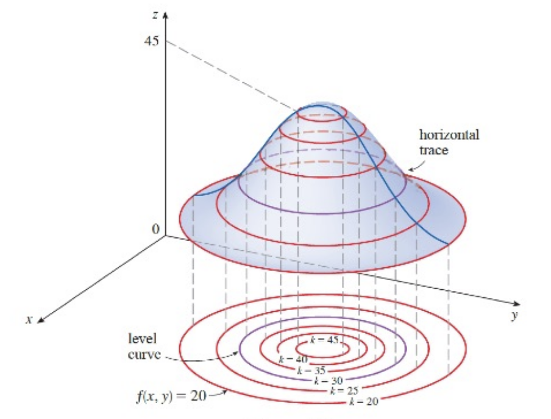

###  Functions of Three or More Variables

A **function of three variables**, $f$, is a rule that assigns to each ordered triple $(x,y,z)$ in a domain $D\sub\R^3$ a unique real number denoted by $f(x,y,z)$. We can gain some insight into $f$ by examining its **level surfaces**, which are the surfaces with equations $f(x,y,z)=k$, where $k$ is a constant. If the point $(x,y,z)$ moves along a level surface, the value of $f(x,y,z)$ remains fixed.

Functions of any number of variables can be considered. A **function of $n$ variables** is a rule taht assigns a number $z=f(x_1,x_2,\dots,x_n)$ to an n-tuple $(x_1,x_2,\dots,x_n)$ of real numbers. Sometimes we use vector notation to write such functions more compactly: If $\boldsymbol{x}=\langle x_1,x_2,\dots,x_n\rangle$, we often write $f(\boldsymbol{x})$ in place of $f(x_1,x_2,\dots,x_n)$. With this notation we can rewrite the function as
$$
f(\boldsymbol{x})=\boldsymbol{c}\cdot\boldsymbol{x}
$$
where $\boldsymbol{c}=\langle c_1,c_2,\dots,c_n \rangle$ and $\boldsymbol{c}\cdot\boldsymbol{x}$ denotes the dot product of the vectors $\boldsymbol{c}$ and $\boldsymbol{x}$ in $V_n$.

## Limits

### Limits of Functions of Two Variables

Let $f$ be a function of two variables whose domain $D$ includes points arbitrarily close to $(a,b)$. Then we say that the **limit of $f(x,y)$ as $(x,y)$ approaches $(a,b)$** is $L$ and we write
$$
\lim_{(x,y)\to(a,b)}f(x,y)=L
$$
if for every number $\varepsilon>0$ there is a corresponding number $\delta>0$ such that
$$
\text{if }(x,y)\in D\quad\text{and}\quad 0<\sqrt{(x-a)^2+(y-b)^2}<\delta\quad\text{then}\quad|f(x,y)-L|<\varepsilon
$$

### Showing that a Limit doesn't exist

One way to show that $\lim_{(x,y)\to(a,b)}f(x,y)$ does not exist is to find different paths of approach along which the function has different limits.

If $f(x,y)\to L_1$ as $(x,y)\to(a,b)$ along a path $C_1$ and $f(x,y)\to L_2$ as $(x,y)\to(a,b)$ along a path $C_2$, where $L_1\ne L_2$, then $\lim_{(x,y)\to(a,b)}f(x,y)$ does not exist.

### Properties of Limits

The Limit Laws can be extended to functions of two variables. Assuming that the indicated limits exist, we can state these laws verbally as follows:

| Law                   | Description                                                  |
| --------------------- | ------------------------------------------------------------ |
| Sum Law               | The limit of a sum is the sum of the limits.                 |
| Difference Law        | The limit of a difference is the difference of the limits.   |
| Constant Multiple Law | The limit of a constant times a function is the constant times the limit of the function. |
| Product Law           | The limit of a product is the product of the limits.         |
| Quotient Law          | The limit of a quotient is the quotient of the limits (the limit of the denominator is not 0) |

### Continuity

A function $f$ of two variables is called **continuous at** $(a,b)$ if
$$
\lim_{(x,y)\to(a,b)}f(x,y)=f(a,b)
$$
We say $f$ is **continuous on** $D$ if $f$ is continuous at every point $(a,b)$ in $D$.

## Partial Derivative

### Partial Derivatives of Functions of Two Variables

In general, if $f$ is a function of two variables $x$ and $y$, suppose we let only $x$ vary while keeping $y$ fixed, say $y=b$, where $b$ is a constant.

Then we are really considering a function of a single variable $x$, namely, $g(x)=f(x,b)$. If $g$ has a derivative at $a$, then we call it the **partial derivative of $f$ with respect to $x$ at $(a,b)$** and denote it by $f_x(a,b)$. Thus
$$
f_x(a,b)=g'(a)\quad\text{where}\quad g(x)=f(x,b)
$$
Similarly, the **partial derivative of fwith respect to $y$ at $(a,b)$**, denoted by $f_y(a,b)$, is obtained by keeping $x$ fixed $(x= a)$ and finding the ordinary derivative at $b$ of the function $G(y)=f(a,y)$:
$$
f_y(a,b)=\lim_{h\to0}\frac{f(a,b+h)-f(a,b)}{h}
$$
**Definition**: If $f$ is a function of two variables, its **partial derivatives** are the functions $f_x$ and $f_y$ defined by
$$
f_x(x,y)=\lim_{h\to0}\frac{f(x+h,y)-f(x,y)}{h}
\\[5pt]
f_y(x,y)=\lim_{h\to0}\frac{f(x,y+h)-f(x,y)}{h}
$$
If $z=f(x,y)$, we can use other notations:
$$
f_x(x,y)=f_x=\frac{\partial f}{\partial x}=\frac{\partial}{\partial x}f(x,y)=\frac{\partial z}{\partial x}=f_1=D_1f=D_xf
\\[5pt]
f_y(x,y)=f_y=\frac{\partial f}{\partial y}=\frac{\partial}{\partial y}f(x,y)=\frac{\partial z}{\partial y}=f_2=D_2f=D_yf
$$
**Rule of Finding Partial Derivatives of $z=f(x,y)$**

1. To find $f_x$ regard $y$ as a constant and differentiate $f(x,y)$ with respect to $x$.
2. To find $f_y$ regard $x$ as a constant and differentiate $f(x,y)$ with respect to $y$.

### Interpretations of Partial Derivatives

To give a geometric interpretation of partial derivatives, we know that the equation $z=f(x,y)$ represents a surface $S$ (the graph of $f$). lf $f(a,b)=c$, then the point $P(a, b, c)$ lies on $S$. By fixing $y= b$, we are restricting our attention to the curve $C_1$,in which the vertical plane $y= b$ intersects $S$. (in other words, $C_1$ is the trace of $S$ in the plane $y=b$.) Likewise, the vertical plane $x= a$ intersects $S$ in a curve $C_2$. Both of the curves $C_1$ and $C_2$ pass through the point $P$.

### Functions of Three or More Variables

Partial derivatives can also be defined for functions of three or more variables. For example, if $f$ is a function of three variables $x$, $y$, and $z$, then its partial derivative with respect to $x$ is defined as
$$
f_x(x,y,z)=\lim_{h\to0}\frac{f(x+h,y,z)-f(x,y,z)}{h}
$$
and it's found by regarding $y$ and $z$ as constants and differentiating $f(x,y,z)$ with respect to $x$.

If $w=f(x,y,z)$, then $f_x=\frac{\partial w}{\partial x}$ can be interpreted as the rate of change of $w$ with respect to $x$ when $y$ and $z$ are held fixed. But we can't interpret it geometrically because the graph of $f$ lies in four-dimensioinal space.

In general, if $u$ is a function of $n$ variables, $u = f(x_1, x_2,\dots,x_n)$, its partial derivative with respect to the $i$-th variable $x_i$ is
$$
\frac{\partial u}{\partial x_i}=\lim_{h\to0}\frac{f(x_1,\dots,x_{i-1},x_i+h,x_{i+1},\dots,x_n)-f(x_1,\dots,x_{i-1},x_i,x_{i+1},\dots,x_n)}{h}
$$
and we also write
$$
\frac{\partial u}{\partial x_i}=\frac{\partial{f}}{\partial{x_i}}=f_{x_i}=f_i=D_if
$$

### Higher Derivatives

If $f$ is a function of two variables, then its partial derivatives $f_x$ and $f_y$ are also functions of two variables, so we can consider their partial derivatives $(f_x)_x$, $(f_x)_y$, $(f_y)_x$, and $(f_y)_y$, which are called the **second partial derivatives** of $f$.

If $z=f(x,y)$, we use the following notation
$$
(f_x)_x=f_{xx}=f_{11}= \frac{\partial}{\partial x}\left( \frac{\partial f}{\partial x} \right)=\frac{\partial^2f}{\partial x^2}=\frac{\partial^2z}{\partial x^2}
\\[5pt]
(f_y)_y=f_{yy}=f_{22}= \frac{\partial}{\partial y}\left( \frac{\partial f}{\partial y} \right)=\frac{\partial^2f}{\partial y^2}=\frac{\partial^2z}{\partial y^2}
\\[5pt]
(f_x)_y=f_{xy}=f_{12}= \frac{\partial}{\partial y}\left( \frac{\partial f}{\partial x} \right)=\frac{\partial^2f}{\partial y\partial x}=\frac{\partial^2z}{\partial y\partial x}
\\[5pt]
(f_y)_x=f_{yx}=f_{21}= \frac{\partial}{\partial x}\left( \frac{\partial f}{\partial y} \right)=\frac{\partial^2f}{\partial x\partial y}=\frac{\partial^2z}{\partial x\partial y}
$$
Thus the notation $f_{xy}$ means that we first differentiate with respect to $x$ and then with respect to $y$, whereas in computing $f_{yx}$ the order is reversed.

**Clairaut's Theorem**: Suppose $f$ is defined on a disk $D$ that contains the point $(a,b)$. If the functions $f_{xy}$ and $f_{yx}$ are both continuous on $D$, then
$$
f_{xy}(a,b)=f_{yx}(a,b)
$$
Partial derivatives of order 3 or higher can also be defined. For instance, 
$$
f_{xyy}=(f_{xy})_y=\frac{\partial}{\partial y}\left( \frac{\partial^2f}{\partial y\partial x} \right)=\frac{\partial^3f}{\partial y^2\partial x}
$$
and using Clairaut's Theorem it can be shown that $f_{xyy}=f_{yxy}=f_{yyx}$ if these functions are continuous.

### Partial Differential Equations

Partial derivatives occur in partial differential equations that express certain physical laws.
For instance, the partial differential equation
$$
\frac{\partial^2u}{\partial x^2}+\frac{\partial^2u}{\partial y^2}=0
$$
is called the **Laplace's equation**. Solutions of this equation are called **harmonic functions**; they play a role in problems of heat conduction, fluid flow, and electric potential.

The **Wave equation**
$$
\frac{\partial^2u}{\partial t^2}=a^2\frac{\partial^2 u}{\partial x^2}
$$
describes the motion of a waveform, which could be an ocean wave, a sound wave, a light wave, or a wave traveling along a vibrating string.

## Tangent Planes and Linear Approximations

### Tangent Planes

Suppose a surface $S$ has equation $z = f(x, y)$, where $f$ has continuous first partial derivatives, and let $P(x_0, y_0, z_0)$ be a point on $S$.

Let $C_1$ and $C_2$ be the curves obtained by intersecting the vertical planes $y=y_0$ and $x=x_0$ with the surface $S$. Then the point $P$ lies on both $C_1$ and $C_2$. Let $T_1$ and $T_2$ be the tangent lines to the curves $C_1$ and $C_2$ at the point $P$. 

Then the tangent plane to the surface $S$ at the point $P$ is defined to be the plane that contains both tangent lines $T_1$ and $T_2$.

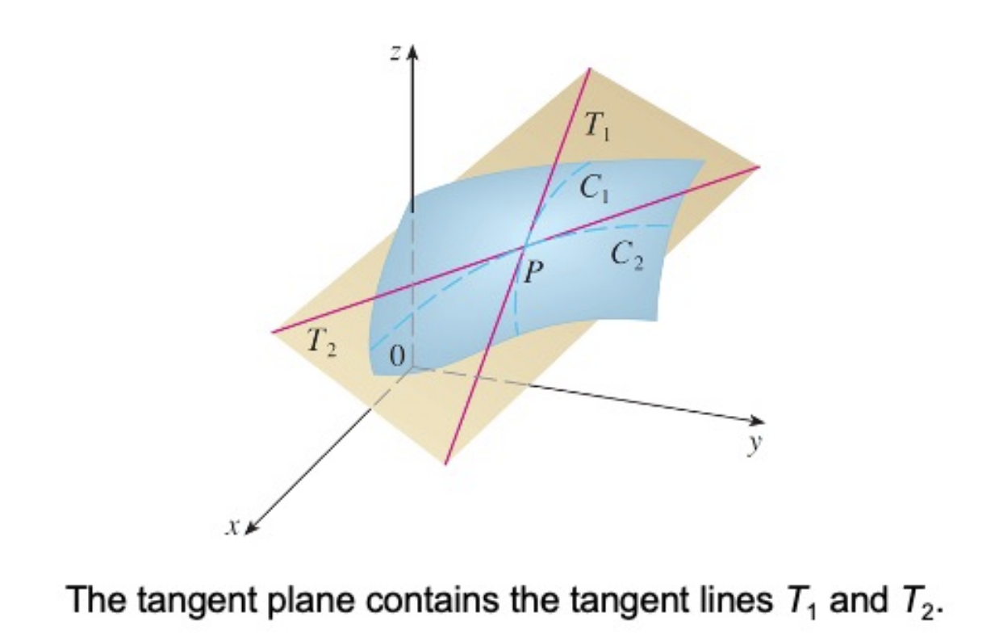 

If $C$ is any other curve that lies on the surface $S$ and passes through $P$, then its tangent line at $P$ also lies in the tangent plane. Therefore you can think of the tangent plane to $S$ at $P$ as consisting of all possible tangent lines at $P$ to curves that lie on $S$ and pass through $P$. The tangent plane at $P$ is the plane that most closely approximates the surface $S$ near the point $P$.

We know that any plane passing through the point $P(x_0,y_0,z_0)$ has an equation of the form
$$
A(x-x_0)+B(y-y_0)+C(z-z_0)=0
$$
By dividing this equation by $C$ and letting $a=-\frac{A}{C}$ and $b=-\frac{B}{C}$, we can write it in the form
$$
z-z_0=a(x-x_0)+b(y-y_0)
$$
If the equation represents the tangent plane at $p$, then its itersection with the plane $y=y_0$ must be the tangent line $T_1$. Setting $y=y_0$ gives
$$
z-z_0=a(x-x_0)\quad\text{where}\;y=y_0
$$
and we recognize this as the equation (in point-slope form) of a line with slope $a$.

But we know that the slope of the tangent $T_1$ is $f_x(x_0,y_0)$. Therefore $a=f_x(x_0,y_0)$. Similarly, we get $z-z_0=b(y-y_0)$, which must represent the tangent line $T_2$, so $b=f_y(x_0,y_0)$. 

**2 Equation of a Tangent Plane**: Suppose $f$ has continuous partial derivatives. An equation of the tangent plane to the surface $z=f(x,y)$ at the point $P(x_0,y_0,z_0)$ is 
$$
z-z_0=f_x(x_0,y_0)(x-x_0)+f_y(x_0,y_0)(y-y_0)
$$

### Linear Approximations

An equation of the tangent plane to the graph of a function $f$ of two variables at the point $(a,b,f(a,b))$ is
$$
z=f(a,b)+f_x(a,b)(x-a)+f_y(a,b)(y-b)
$$
The linear function whose graph is this tangent plane, namely
$$
L(x,y)=f(a,b)+f_x(a,b)(x-a)+f_y(a,b)(y-b)
$$
is called the **linearization** of $f$ at $(a,b)$.

**Definition**: If $z=f(x,y)$, then $f$ is **differentiable** at $(a,b)$ if $\Delta z$ can be expressed in the form
$$
\Delta z=f_x(a,b)\Delta x+f_y(a,b)\Delta y+\varepsilon_1\Delta x+\varepsilon_2\Delta y
$$
where $\varepsilon_1$ and $\varepsilon_2$ are functions of $\Delta x$ and $\Delta y$ such that $\varepsilon_1,\varepsilon_2\to0$ as $(\Delta x,\Delta y)\to(0,0)$. The definition says taht a differentiable function is one for which the linear approximation is a good approximation when $(x,y)$ is near $(a,b)$. In other words, the tangent plane approximates the graph of $f$ well near the point of tangency.

**Theorem**: lf the partial derivatives $f_x$ and $f_y$ exist near $(a,b)$ and are continuous at $(a,b)$, then $f$ is differentiable at $(a,b)$.

### Differentials

### Functions of Three or More Variables

